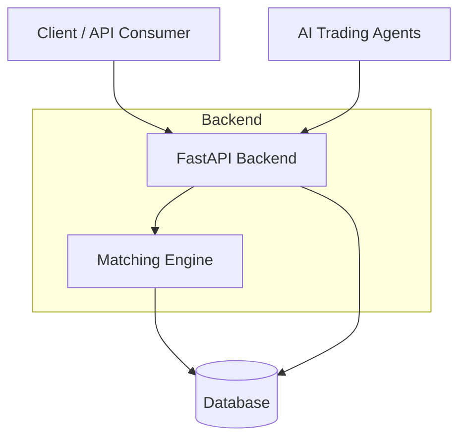

# System Architecture Diagram

**Flow summary:**
- Users and AI agents both submit orders through the same API layer.
- The API validates requests and hands trading logic off to the Matching Engine.
- The Matching Engine is the only component that writes trade outcomes to the Database.
- No external inputs for now — this is just the core loop: place order → match → record.
