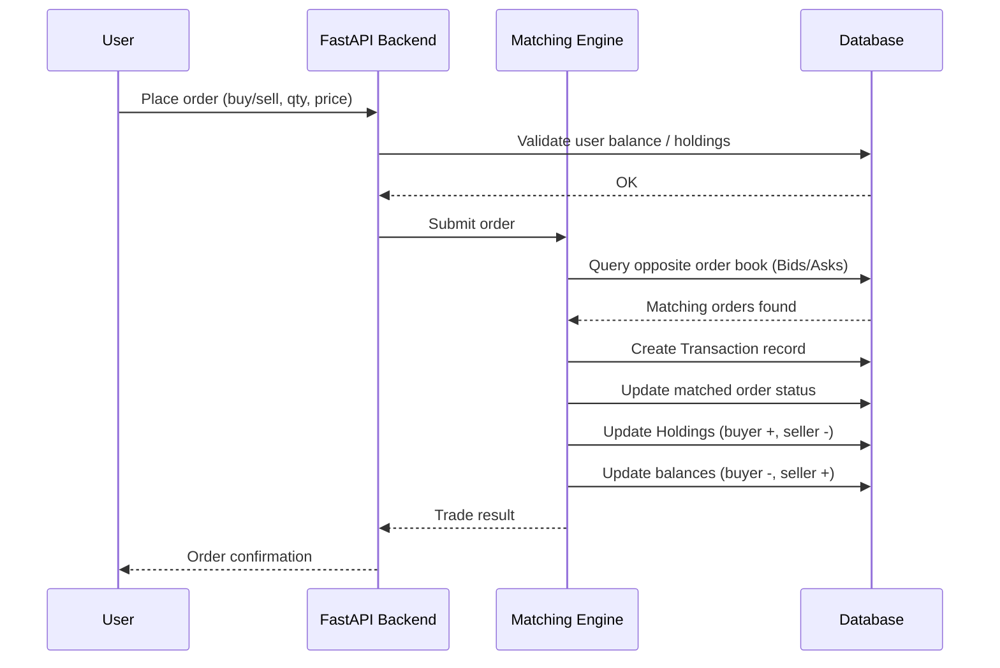

# Trade Execution Sequence Diagram (Market Order)

**Flow summary:**
- Validation happens before the order ever reaches the Matching Engine, so bad orders never enter the order book.
- Every state change (Transaction, order status, Holdings, balances) is written by the Matching Engine only — no other component mutates trade-related tables directly.
- The user receives one final confirmation once all downstream updates complete.
